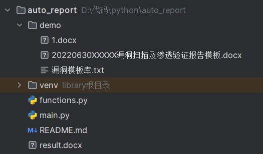

# Milo自动化出报告系统


## 前言:

各位安全工程师每天总是有出不完的报告(本人:渗透五分钟,报告两小时)

从自己记录的文档查到出报告模板,漏洞模板,极其麻烦

而这个系统可以帮助各位在出报告时更据需求自定义模板,并且快速的输出所需要的内容

设计思路主要是:读取用户输入,从用户输入中,读取到漏洞相关信息,进入漏洞库动态匹配,最后返回组成数据源,进行文档输出



```shell
-demo # 模板文件夹
	-1.docx # 目前选用的模板
	-漏洞模板库.txt #漏洞相关信息都写进这个文件就可以(千万不要有空格!!!!!!!!!!)
-venv # 虚拟环境
-function.py # 被调用的方法文件夹
-main.py # 主函数文件
```

## 安装环境

* 纯python

```shell
pip install docxtpl
```

## 运行

```
python main.py
```

## 📦 使用手册

### 用户输入

```python
# 需要用户输入的内容(图片一类的之前是想着输入绝对路径读取的,后来想想太麻烦了,有那功夫直接复制粘贴好了)
vul_name = input("请输入漏洞名称：")
    accesspoint = input("请输入测试接入点：3（互联网）、4（内网）")
    addr = input("漏洞URL:")
    level = input("请输入漏洞评级：")
    process = input("请输入利用过程：")
    image_url = input("请输入漏洞验证图片地址：")
ceshi_name = input("请输入测试项名称：")
    accesspoint = input("请输入测试接入点：3（互联网）、4（内网）")
    addr = input("测试项URL:")
    image_url = input("请输入漏洞验证图片地址：")
# 这些都是需要用户输入的内容,基本包含了一份报告中所有有可能需要的东西,如果说,多了的话输入时候可以随便输入然后回车输入下一个,只要在模板中不做对应标记就不会输出。
```


## 模板制作

```jinja2
{{report_center}} # 客户单位
{{report_systemname}} # 系统名称
{{report_test_url}} #测试url(数组,输入时空格分隔)
{{high_all}} # 所有高危漏洞(大数组,子集也是数组,所有高危漏洞,子数组可以参考vuls)
{{middle_all}} # 所有中危漏洞(大数组,子集也是数组,所有中危漏洞,子数组可以参考vuls)
{{low_all}} # 所有严重漏洞(大数组,子集也是数组,所有低危漏洞,子数组可以参考vuls)
{{ceshi_all}} # 所有测试项(大数组,子集也是数组,所有测试项,子数组可以参考ceshis)
{{count_addr}} #测试url计数
{{count_vuls}} #总漏洞计数
{{count_high}} #高危漏洞计数
{{count_middle}} #中危漏洞计数
{{count_low}} #低危漏洞计数
{{level_result}} #最终系统评级
{{vuls}} #漏洞集
{{ceshis}} #测试项集
```

## 数据存储

```python
# jinjia2是支持用户自定义模板的,本质还是关键字匹配只需要{{变量}}(用的库是docxptl,这个库集成了jinjia2,单纯用jinjia2,一直有编码问题无法解决。)
# 漏洞相关内容
vuls = {
            'vul_name':vul[0],
            'vul_accesspoint':vul_accesspoint,
            'vul_url':vul[2],
            'vul_level':level,
            'vul_describe':vul[4],
            'vul_image':vul[5],
            'vul_details':vul[7],
            'vul_harm':vul[8],
            'vul_repair':vul[9],
# 测试项相关内容
    ceshis = {
            'ceshi_name':ceshi[0],
            'ceshi_accesspoint':ceshi_accesspoint,
            'ceshi_url':ceshi[2],
            'ceshi_image':ceshi[3],
        }
# 保存将被替换索引的所有部分
    data = {
        'report_center':report_center,
        'report_systemname':report_systemname,
        'report_test_url':report_test_url,
        'high_all':high_all,
        'middle_all':middle_all,
        'low_all':low_all,
        'ceshi_all': ceshi_all,
        'count_addr':len(report_test_url),
        'count_vuls': len(vuls_list),
        'count_high': len(high_all),
        'count_middle': len(middle_all),
        'count_low': len(low_all),
        'level_result':level_result,
        'vuls':vuls_result,
        'ceshis':ceshi_result
        }
 # data段可以使用{{key}}的方式直接写进模板，ceshi以及vul段是数组，里面包含了字典，一个字典就是一个漏洞（测试项），要用到for这样一段的jinjia2模板语法，具体可以参照1.docx
```

## 联系方式

目前这只是第一版可能问题比较多,

bug或者要是实在不太明白使用可以+v:ghust_xiagao

## 后期规划

后面可能会通过markdown模板读取的方式不再需要用户输入,而是通过文档读取的方式,更快速的输出报告

## 免责声明

使用本程序请自觉遵守当地法律法规，出现一切后果均与作者无关。

本工具旨在帮助企业快速定位漏洞修复漏洞,仅限授权安全测试使用!

严格遵守《中华人民共和国网络安全法》,禁止未授权非法攻击站点!

由于用户滥用造成的一切后果与作者无关。

切勿用于非法用途，非法使用造成的一切后果由自己承担，与作者无关。

## 参考

https://github.com/Mustard404/Savior

http://www.360doc.com/content/21/1130/10/77916720_1006517842.shtml
